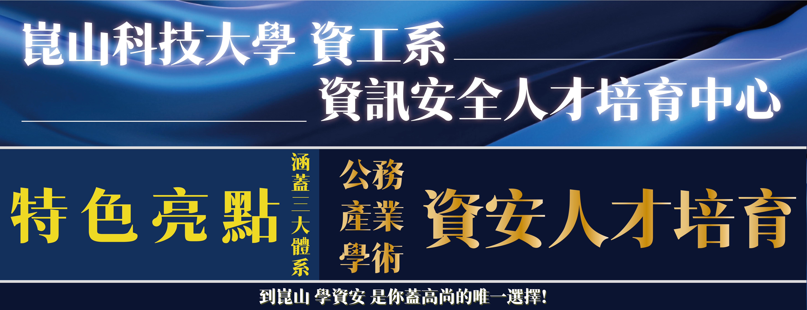

# 崑山科技大學 資工系  資訊安全人才培育中心
- 看看我們的特色亮點:涵蓋三大體系
  - 公務資安人才培育
  - 產業資安人才培育
  - 學術資安人才培育
- 到崑山 學資安 是你蓋高尚的唯一選擇!

# 認識主持人  恩師龍大大

# 2023年最最轟動 的資安課程 來了!   趕快報名 全程免費
- 資安實戰入門 課程  
  - 11月15日 即將開課
  - 點選 [報名網址]() 
- [國家級證照]IPAS 初階資安工程師認證 課程  
  - 11月1日 即將開課
  - 點選 [報名網址]()

# 就讀 崑山科技大學 資工系 繼續取得更高的成就與薪水:
- 每學期都有不同主題的資安專業實戰課程!全國獨一無二!
- 考取更高階的資安專業證照(「行政院國家資通安全會報」認可之資通安全專業證照)!全國無可匹敵!
  - 價值3 萬元的 IPAS 中階資安工程師認證 課程
  - 價值NT$65,000元 的 EC-Council CEH駭客技術專家認證課程
  - 價值NT$56,000元 的 CISSP資安系統專家認證課程(Certified Information Systems Security Professional Course)
  - 大學期間只要考取任何上述證照之一,恩師龍大大就會推薦|安排你到資安公司上班!!
